# Product Configurations:

1.  Calm VM 3.7.2.1 on PC2024.1
2.  Infrastructure cluster on AOS 6.8.0.5 on PC2024.1.01

## What is a Project

Project is the logical construct that allowed an administrator to assign both infrastructure resources and the roles/permissions of Active Directory users/groups to specific Blueprints and Applications.

# Create a Project

1.  Click on **Hamburger Menu**.  Select **Admin Center**

    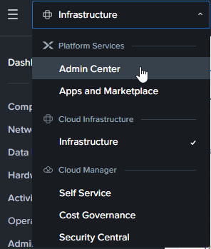

2.  Click on **Projects** 

    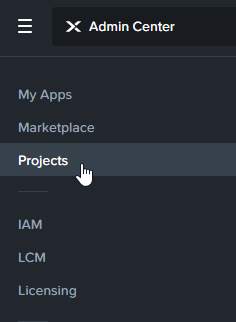

3.  Click on **Create Project**.

    

2.  Fill in the Project Name. Eg TenantProject-TraineeNo. Click on
    **Create**.

    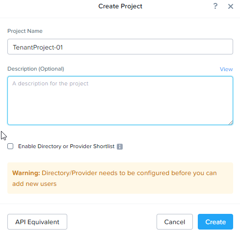

3.  This project is in the **Pending** state.  Click on **Infrastructure**

    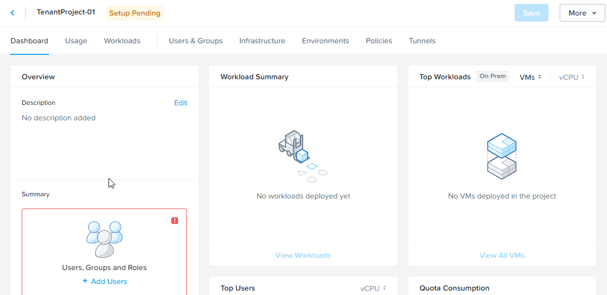

## Add Infrastructure in Project

1.  Click on **Add Infrastructure**. Select **NTNX_LOCAL_AZ_xx** as assigned by the trainer

    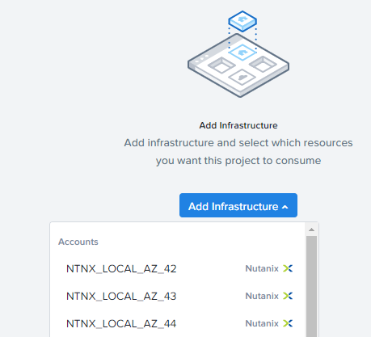

2.  Click on **Configure Resources**. 

    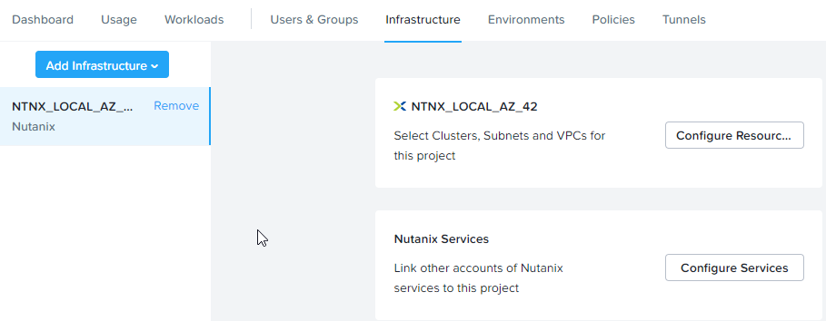

3.  Click on **Select Cluster**.  Click on **Select VLANs**

    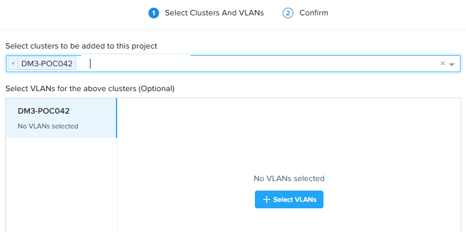

4.  Check on **Primary_xx** or **Secondary_xx** Network as assigned by the trainer.  

    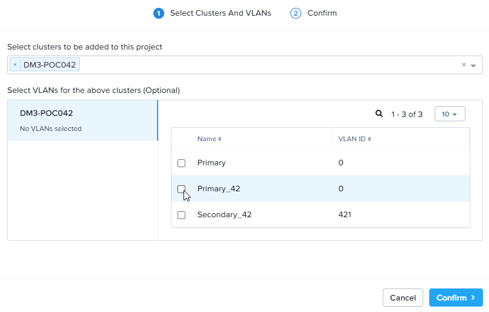

### No VPC in the cluster

1.  This section is for cluster not configured with VPC.  Please scroll down to **Configure VPC to the project** for cluster configured with VPC.

2.  Click **Confirm**

    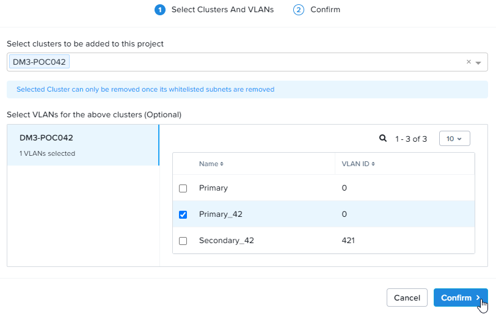

3.  Click **Confirm**

    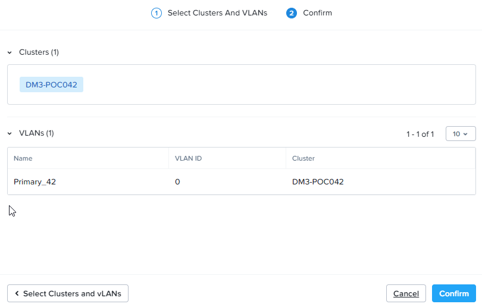

4.  Click **Save**   

    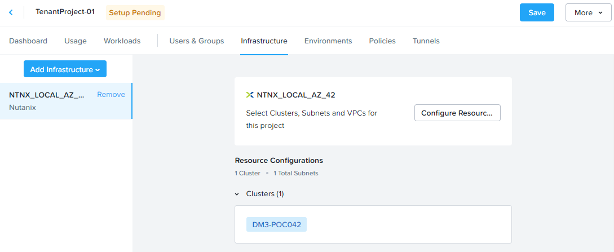

5.  The project is in the **Active** state

    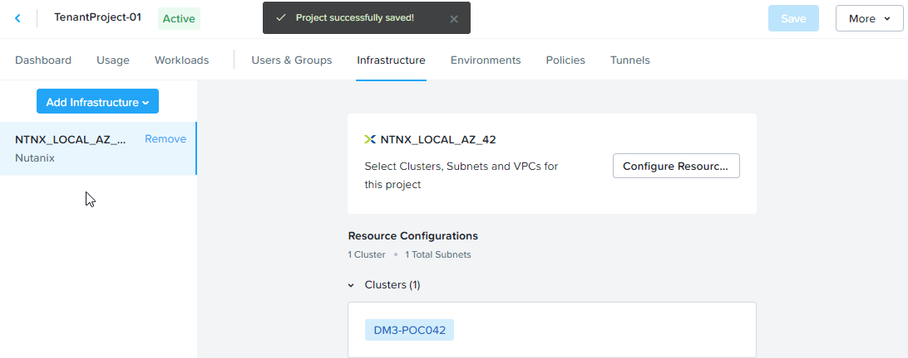

### Configure VPC to the project 

1.  This section is for cluster configured with VPC.  Select **VPCs & Subnets**

    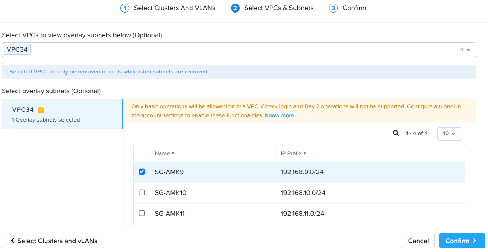

2.  Select **VPC**. Select the Overlay Subnet **SG-AMK** Network. Click
    on **Confirm**.

    

3.  Select **Confirm**.

    

4.  Click on **Save**

    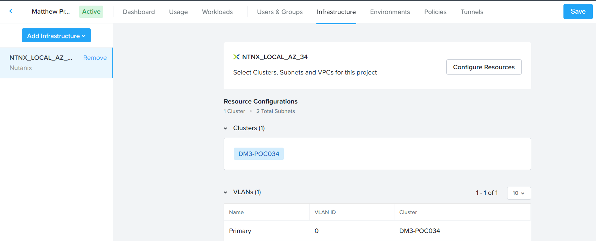

## Configure Quota in Project

1.  Configure this section to configure the quota allocated to this project.

2.  Check the **Quotas**.  Fill in the following:

    - 100 vCPU
    - 100 GB Memory
    - 500 GB Disk

    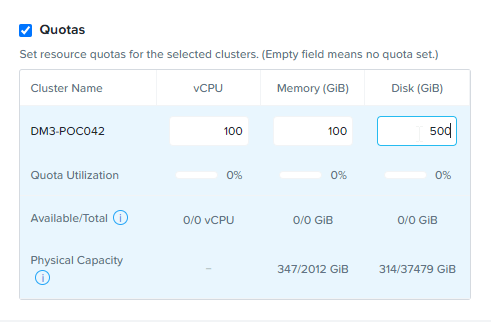

3.  Click on **Save**

