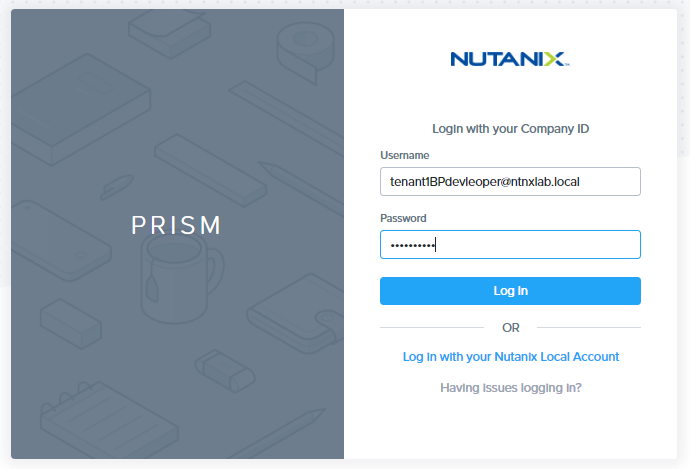
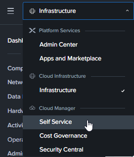
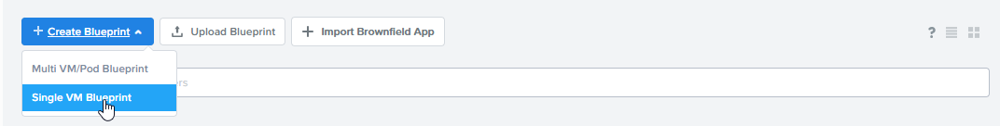
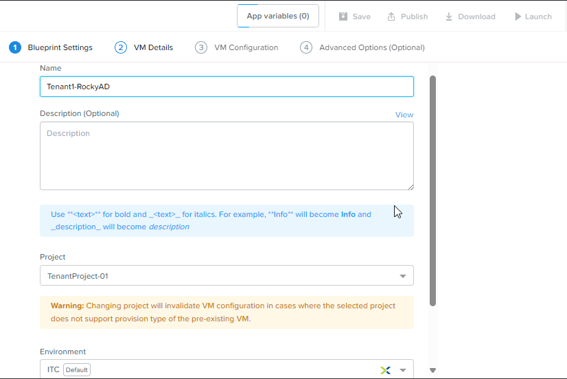
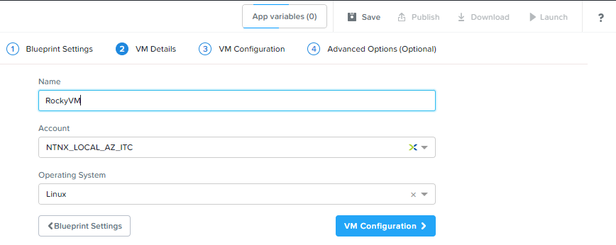
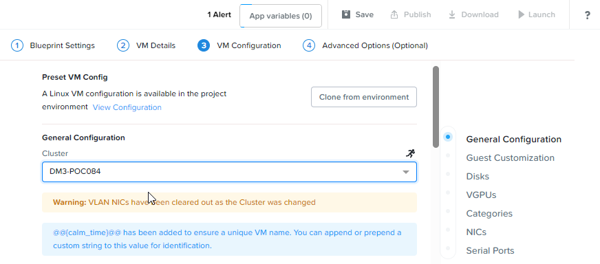
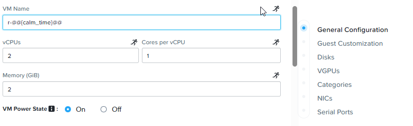
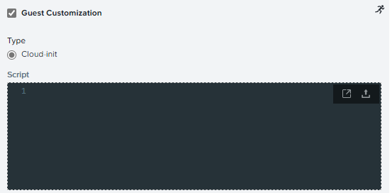

# Product Configurations:

1.  Calm VM 3.8.0 on PC2024.1
2.  Infrastructure cluster on AOS 6.8.0.5 on PC2024.1.01

# Overview

:::info

Estimated time to complete: **60 minutes**

In this exercise you will create a NCM Self Service Blueprint.  The image (Rocky Linux 9.4), install cloud-init, 
install packages and join Active Directory (AD) domain.  We'll also add a script to remove the computer from the Domain upon deletion.

:::

# Creating Blueprint

1.  Login using the Blueprint Designer.

    

2.  Click on hamburger menu.  Select **Self Service**

    

2.  Click on **Blueprints** from the sidebar and click **+ Create Blueprint**, choose **Single VM Blueprint**.

    

3. Fill in the following.  Click on **VM Details**

    -  **Name:** Tenant**XYZ**_Rocky_AD  Replace XYZ with your assigned trainee no
   
    

4.  Replace the **VM Name** to **RockyVM**.  Click on **VM Configuration**

    

5.  Select the cluster

    

6.  Fill in the following:

    -  **VM Name**: ``r-@@{calm_time}@@``
    -  **vCPU**: 2 - Check the running man
    -  **core per CPU**: 1 - Check the running man
    -  **Memory (GIB)**: 2 - Check the running man
    -  **VM Power State**: On

     

7.  Check the **Guest Customization**.  Paste the contents inside the Guest Customization box.

    ```
    #cloud-config
    disable_root: False
    ssh_enabled: True
    ssh_pwauth: True
    users:
        - name: nutanix
        passwd: @@{ROCKY 2 Credential.secret}@@
        chpasswd: { expire: False }
        ssh-authorized-keys:
        - @@{ROCKY.public_key}@@
        sudo: ['ALL=(ALL) NOPASSWD:ALL']

    #cloud-config
    fqdn: @@{name}@@.@@{domain_name}@@
    manage_etc_hosts: true
    hostname: @@{name}@@
    ```

    