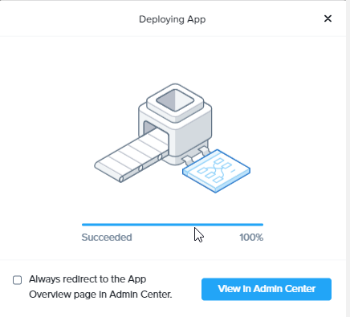

# Product Configurations:

1.  Calm VM 3.8.0 on PC2024.1
2.  Infrastructure cluster on AOS 6.8.0.5 on PC2024.1.01

# Overview

:::info

Estimated time to complete: **45 minutes**

In this exercise you will modify an existing NCM Self Service Blueprint to allow the developer to change VM specification
and take or restore snapshot

:::

# Configure Blueprint to change VM specification

1.  Navigate to the Windows blueprint created earlier.

2.  Click on **+** to add **Update Config**

    

3.  Change the **Name of the Update Configuration** to Change VM specification
    
    

4.  Edit the **VM Configuration** as seen in the picture below

    

5.  Click on **Save** on the top right of the screen

## Launch Blueprint to verify Change VM specification

1.  On the top right of the screen, click on **Launch**

      

2.  .  Fill in the following:

    -  **Application Name** -  Specify a unique name (e.g. Windows-*INITIALS*-1)
    -  **Project** - Select the project
    -  **Environment** - Select the Environment

      

3.  Select the **Application Profile**: **Small**

      

4.  Verify the VM sizing.  

     

5.  Verify the credential for the **DOMAIN_CRED**.  Click on **Deploy**

     

5.  Click on **View in Admin Center**

     

6.  Wait till the application is in the **Running** state.

## Verify Change VM specification

1.  Click on **Manage**.

     

2.  Change the memory from **2 GB** to **3 GB**.  Click on **Run**

     

3.  Click on **Audit**.  Expand on **Change VM Specification**.  Observe the change

     

4.  Click on **Services**.  Observe the change

     

