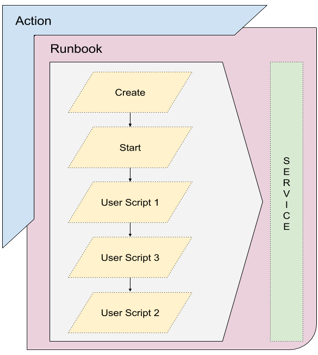

# What is a Runbook

Blueprint describes all elements of an applications.  Runbook describes a series of tasks to be executed across endpoints.  
Both physical server or virtual machine with a network IP address is considered an endpoint.  Runbook can traverse across
applications.  Runbooks can be hooked to a scheduler to be executed on a regular basis.

